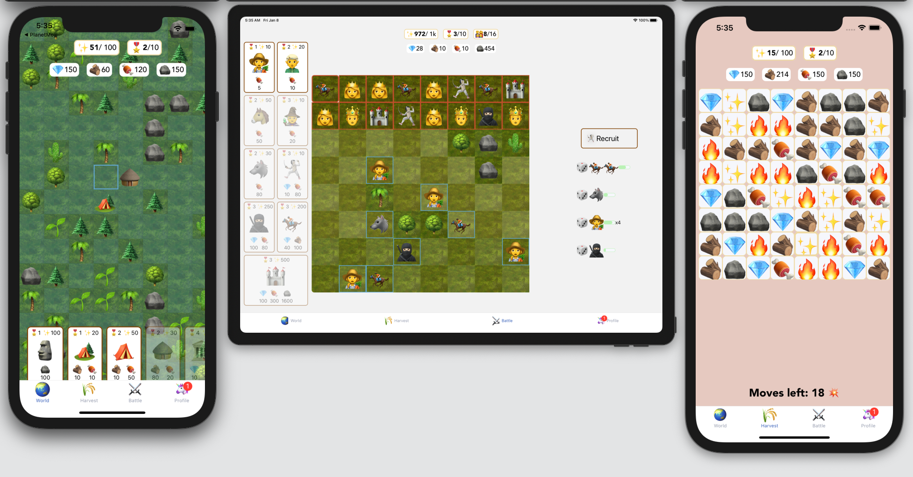

# 🌏PlanetMoji

⚔️ Conquer the world 🌏 with Emojis 🚀

## React-native

by Guillermo Sierra


## Inventory creator

- 🎨 Inspiration: [Zeplin](https://zpl.io/VD1kr3W)
- ⛓ Routing: [React Navigation](https://reactnavigation.org/)
- ⚙ ️State management: [MobX](https://mobx.js.org/) - True separation of concerns: state and view
- 🖌 Styling: [Consistencss](https://consistencss.now.sh/)
- 🧪 Unit tests: item creation

## User Guide

Buy:

- Units: 🥷🏻🧎🏻‍️🧙🏹🗼👸🤴
- Buildings
- progress through amazing Levels 👼👩‍🌾👩‍🚒🧝🥷🏻🧙👸🤴🧖🏻‍🧑‍🚀

### Resources 🪵🥩🪨

## Score🪙💎🔥🧨'

## Install

### ios:

```
cd ios && pod install
yarn start
react-native run-ios
```
